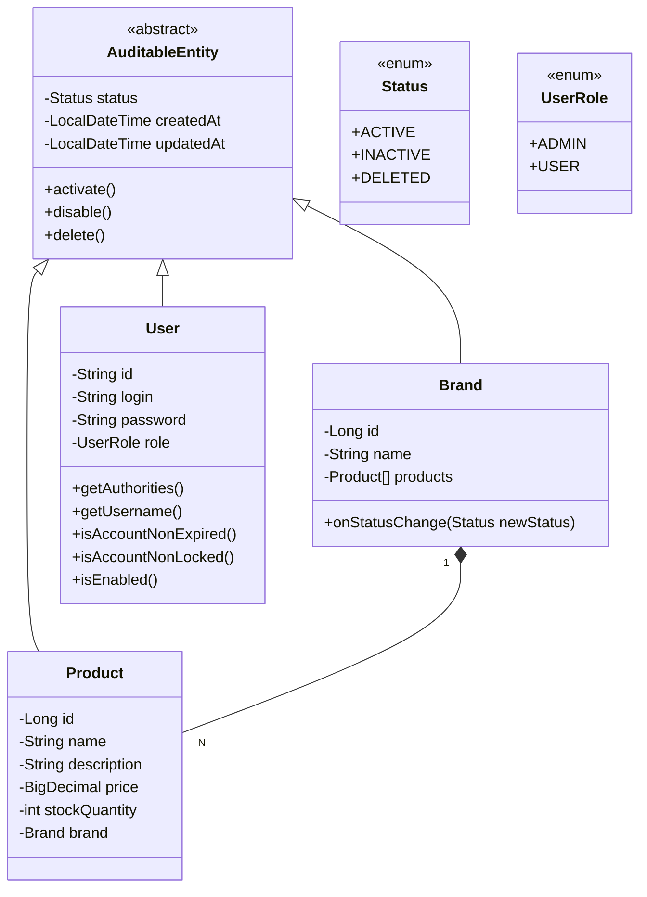

<div align="center">

# API-Catalogo utilizando JWT, MySQL e Docker


<br>


</div>

### Descrição

O API Catálogo é uma aplicação backend em Java 17 com Spring Boot, projetada para gerenciar um catálogo de produtos com segurança e eficiência. Possui autenticação e autorização via JWT, respostas paginadas, tratamento global de exceções e versionamento de banco de dados com Flyway. A API é documentada com OpenAPI/Swagger e utiliza Docker e Docker Compose para deploy, com pipelines automatizados em GitHub Actions. É uma solução moderna, escalável e fácil de integrar.

### Tecnologias usadas
- **Java 17:** Linguagem de programação para o desenvolvimento da aplicação.
- **Spring:** Framework para criação de aplicações Java.
  - **Spring-Web:** Para desenvolvimento de APIs RESTful.
  - **Spring-Validation:** Validação de dados no lado do servidor.
  - **Spring-Security:** Autenticação e autorização.
  - **Spring-Data-JPA:** Integração com bancos de dados usando JPA/Hibernate.
  - **Spring-DevTools:** Facilita o desenvolvimento com reinicialização automática.
- **JWT:** Implementação de tokens JWT para autenticação e autorização.
- **Flyway:** Gerenciamento e versionamento de schema do banco de dados.
  - **Flyway-Core:** Integração principal com Flyway.
  - **Flyway-MySQL:** Suporte específico para banco de dados MySQL.
- **MySQL Connector/J:** Driver JDBC para conexão com MySQL.
- **H2 Database:** Banco de dados em memória para testes e desenvolvimento.
- **SpringDoc OpenAPI:** Documentação interativa para APIs RESTful (Swagger UI).
- **Lombok:** Reduz a verbosidade do código, gerando automaticamente métodos comuns.
- **Maven:** Gerenciador de dependências e build do projeto.
<hr>

### Imagens

- Registro
  

- Login
  

- Exemplo de requisição publica(que não necessita de autenticação/autorização)
  
<hr>

### Diagrama



<hr>

### Como utilizar
##### Requisitos para executar o projeto:
- Docker e Docker Compose instalados na maquina.

Em apenas 3 comandos simples o projeto esta esta disponível.

- Clone o repositório:
```bash
git clone https://github.com/maxjdev/API_Catalogo-utilizando-JWT-MySQL-Docker.git
```

- Navegue até o diretório do projeto:
```bash
cd API_Catalogo-utilizando-JWT-MySQL-Docker
```

- Rode o projeto:
```bash
docker compose up --build
```
<hr>

#### Endpoints
| Rotas                                 | Visibilidade  | Descrição                                            |
|---------------------------------------|---------------|------------------------------------------------------|
| <kbd>POST /auth/*</kbd>               | Público       | Registro e login.                                    |
| <kbd>GET /api/v1/**</kbd>             | Público       | Busca por ID, por nome ou buscar todos com paginação |
| <kbd>PUT/DELETE /api/admin/**</kbd>   | Administrador | Torna entidade ACTIVE, INACTIVE ou faz "full delete" |
| <kbd>POST/PUT/DELETE /api/v1/**</kbd> | Autenticado   | Create, Update ou Delete                             |
<hr>

### Documentação
Acesse a documentação interativa em <a href="http://localhost:9090/swagger-ui.html">http://localhost:9090/swagger-ui.html</a>
<hr>

### Contruibuição
- Para contribuir, bifurque este repositório e envie suas alterações por meio de pull requests.
- Para relatórios de bugs ou sugestões de melhorias, abra um problema na página do projeto.