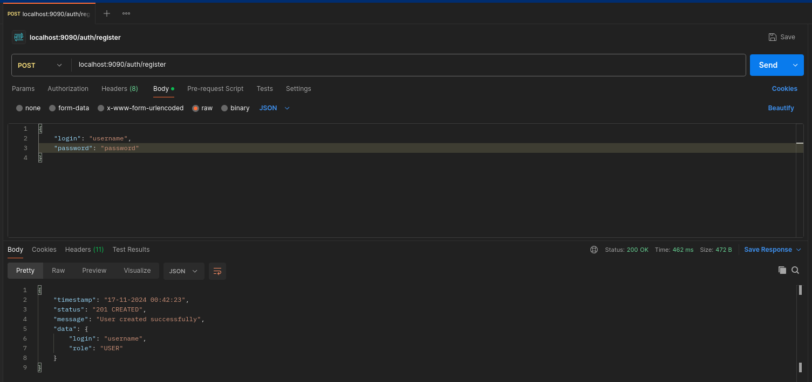
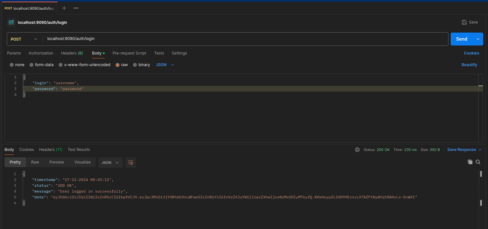
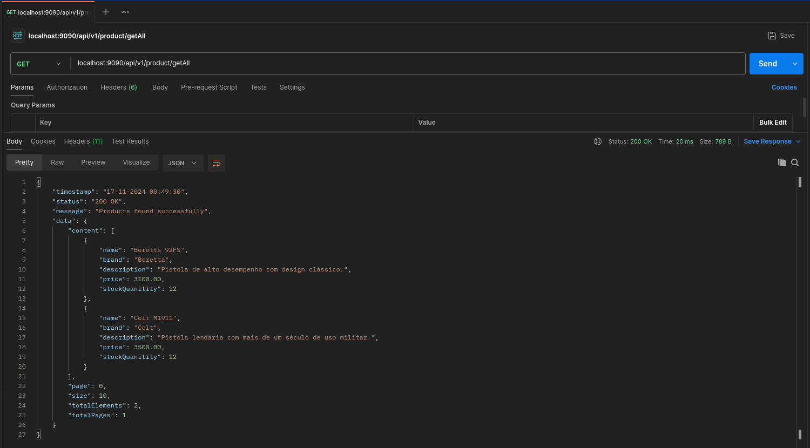
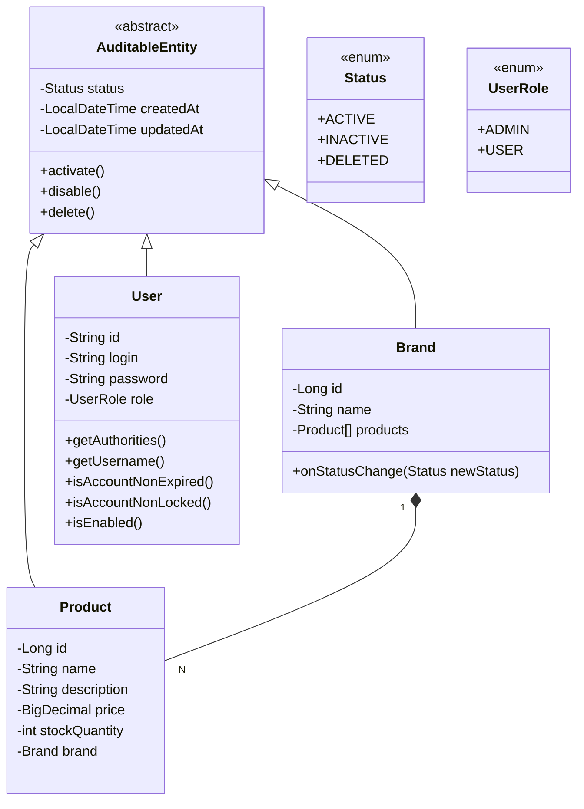

<div align="center">

# API-Catalogo


<br>


</div>

### Descrição

O API Catálogo é uma aplicação backend em Java 17 com Spring Boot, projetada para gerenciar um catálogo de produtos com segurança e eficiência. Possui autenticação e autorização via JWT, respostas paginadas, tratamento global de exceções e versionamento de banco de dados com Flyway. A API é documentada com OpenAPI/Swagger e utiliza Docker e Docker Compose para deploy, com pipelines automatizadas no GitHub Actions. É uma solução moderna, escalável e fácil de integrar.

### Tecnologias usadas
- **Java 17:** Linguagem de programação para o desenvolvimento da aplicação.
- **Spring:** Framework para criação de aplicações Java.
  - **Spring-Web:** Para desenvolvimento de APIs RESTful.
  - **Spring-Validation:** Validação de dados no lado do servidor.
  - **Spring-Security:** Autenticação e autorização.
  - **Spring-Data-JPA:** Integração com bancos de dados usando JPA/Hibernate.
  - **Spring-DevTools:** Facilita o desenvolvimento com reinicialização automática.
- **JWT:** Implementação de tokens JWT para autenticação e autorização.
- **Flyway:** Gerenciamento e versionamento de schema do banco de dados.
  - **Flyway-Core:** Integração principal com Flyway.
  - **Flyway-MySQL:** Suporte específico para banco de dados MySQL.
- **MySQL Connector/J:** Driver JDBC para conexão com MySQL.
- **H2 Database:** Banco de dados em memória para testes e desenvolvimento.
- **SpringDoc OpenAPI:** Documentação interativa para APIs RESTful (Swagger UI).
- **Lombok:** Reduz a verbosidade do código, gerando automaticamente métodos comuns.
- **Maven:** Gerenciador de dependências e build do projeto.
<hr>

### Imagens

- POST para realizar registro de usuário
  

- POST para realizar login/autenticar
  

- GET para listar produtos com paginação
  
<hr>

### Diagrama



<hr>

### Como utilizar
##### Requisitos para executar o projeto:
- Docker e Docker Compose instalados na maquina.

Em apenas 3 comandos simples a API estará disponível para consumo.

- Clone o repositório:
```bash
git clone https://github.com/maxjdev/API_Catalogo-utilizando-JWT-MySQL-Docker.git
```

- Navegue até o diretório do projeto:
```bash
cd API_Catalogo-utilizando-JWT-MySQL-Docker
```

- Rode o projeto:
```bash
docker compose up --build
```
<hr>

### Endpoints
| Rotas                                 | Visibilidade  | Descrição                                            |
|---------------------------------------|---------------|------------------------------------------------------|
| <kbd>POST /auth/*</kbd>               | Público       | Registro e login.                                    |
| <kbd>GET /api/v1/**</kbd>             | Público       | Busca por ID, por nome ou buscar todos com paginação |
| <kbd>PUT/DELETE /api/admin/**</kbd>   | Administrador | Torna entidade ACTIVE, INACTIVE ou faz "full delete" |
| <kbd>POST/PUT/DELETE /api/v1/**</kbd> | Autenticado   | Create, Update ou Delete                             |
<hr>

### Documentação
Acesse a documentação interativa em <a href="http://localhost:9090/swagger-ui.html">http://localhost:9090/swagger-ui.html</a>
<hr>

### Entidades pré-persistidas

#### Via Flyway:
```sql
INSERT INTO tb_brand (name, status, created_at, updated_at)
VALUES
    ('Taurus', 'ACTIVE', NOW(), NOW()),
    ('Imbel', 'ACTIVE', NOW(), NOW()),
    ('Glock', 'ACTIVE', NOW(), NOW()),
    ('Colt', 'ACTIVE', NOW(), NOW()),
    ('Sig Sauer', 'ACTIVE', NOW(), NOW()),
    ('Beretta', 'ACTIVE', NOW(), NOW()),
    ('Smith & Wesson', 'ACTIVE', NOW(), NOW()),
    ('Heckler & Koch', 'ACTIVE', NOW(), NOW());
```
```sql
INSERT INTO tb_product (name, brand_id, description, price, stock_quantity, status, created_at, updated_at)
VALUES
    ('Pistola G2C', 1, 'Pistola compacta e leve, ideal para porte velado.', 2500.00, 15, 'ACTIVE', NOW(), NOW()),
    ('Pistola TS9', 1, 'Pistola para uso tático e esportivo, com alta precisão.', 3200.00, 10, 'ACTIVE', NOW(), NOW()),
    ('Carabina IA2', 2, 'Carabina de alta resistência, utilizada por forças armadas.', 4500.00, 8, 'ACTIVE', NOW(), NOW()),
    ('Pistola .40', 2, 'Pistola popular para uso policial, confiável e durável.', 2800.00, 20, 'ACTIVE', NOW(), NOW()),
    ('Glock 17', 3, 'Modelo clássico da Glock, confiável e amplamente utilizado.', 3000.00, 25, 'ACTIVE', NOW(), NOW()),
    ('Glock 19', 3, 'Modelo compacto da Glock, ideal para porte velado.', 3100.00, 18, 'ACTIVE', NOW(), NOW()),
    ('Colt M1911', 4, 'Pistola lendária com mais de um século de uso militar.', 3500.00, 12, 'ACTIVE', NOW(), NOW()),
    ('Colt Python', 4, 'Revólver de alta precisão e construção robusta.', 3700.00, 5, 'ACTIVE', NOW(), NOW()),
    ('Sig Sauer P320', 5, 'Pistola modular e confiável, usada por forças militares.', 3300.00, 10, 'INACTIVE', NOW(), NOW()),
    ('Sig Sauer P226', 5, 'Pistola clássica de serviço, com alta precisão.', 3400.00, 6, 'DELETED', NOW(), NOW()),
    ('Beretta 92FS', 6, 'Pistola de alto desempenho com design clássico.', 3100.00, 12, 'INACTIVE', NOW(), NOW()),
    ('Beretta PX4 Storm', 6, 'Pistola compacta, ideal para defesa pessoal.', 2900.00, 5, 'DELETED', NOW(), NOW()),
    ('S&W M&P9', 7, 'Pistola de polímero com ergonomia avançada.', 3200.00, 9, 'INACTIVE', NOW(), NOW()),
    ('S&W 686', 7, 'Revólver robusto, projetado para alto desempenho.', 3600.00, 3, 'DELETED', NOW(), NOW()),
    ('HK USP', 8, 'Pistola versátil, projetada para uso militar e policial.', 3500.00, 8, 'INACTIVE', NOW(), NOW()),
    ('HK VP9', 8, 'Pistola leve com sistema de disparo inovador.', 3400.00, 4, 'DELETED', NOW(), NOW());
```
#### Via CommandLineRunner:
```java
@Override
public void run(String... args) throws Exception {
  authenticationService.register(new RegisterDTO("useradmin", "passwordadmin", UserRole.ADMIN));
  authenticationService.register(new RegisterDTO("userstandard", "passwordstandard", UserRole.USER));
}
```
<hr>

### Contruibuição
- Para contribuir, faça um fork deste repositório e envie suas alterações por meio de pull requests.
- Para relatórios de bugs ou sugestões de melhorias, abra uma issue na página do projeto.
